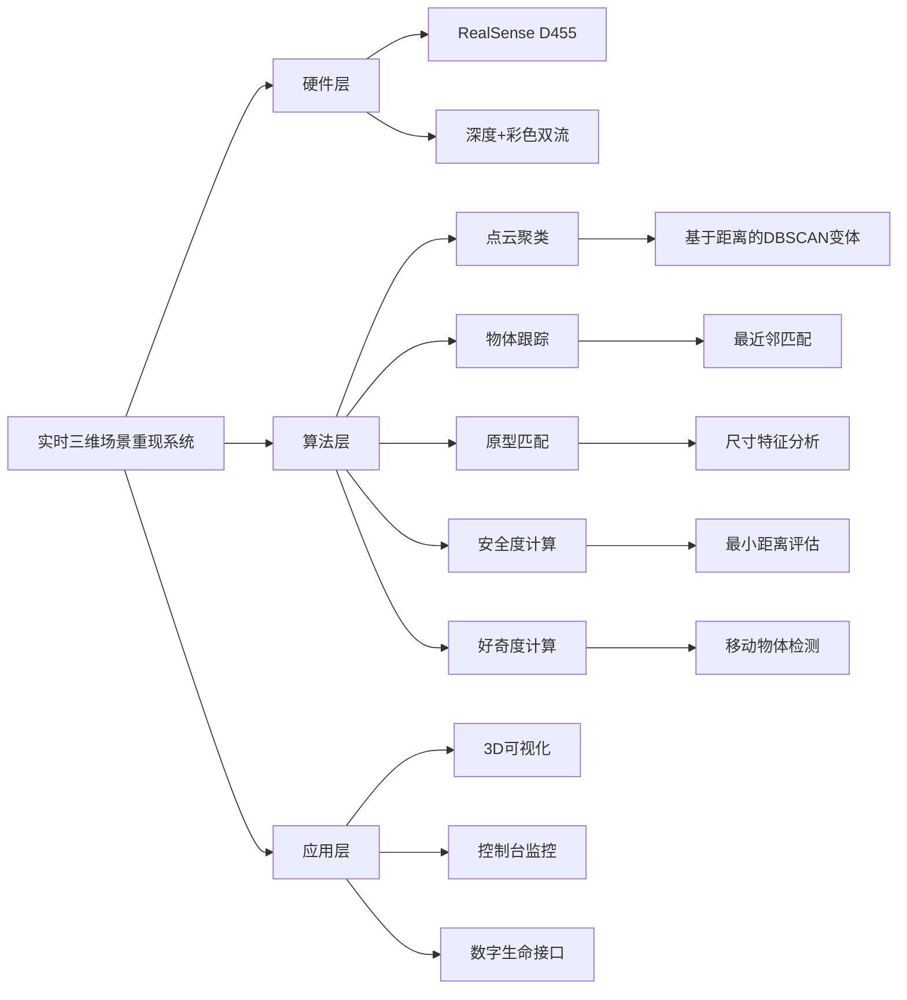

# 完整实现：实时三维场景重现系统（带准确坐标 + 占位符原型）

##  📝 基本信息
- **原文链接**: [CSDN博客文章](https://blog.csdn.net/qq_45118549/article/details/155562560)
- **分类标签**: 计算机视觉、三维重建、实时系统、数字生命
- **作者**: qq_45118549
- **技术栈**: RealSense D455、OpenCV Viz、C++17
- **测试日期**: 2025-12-03（作者亲测）

##  快速了解
本文完整实现了一个**实时三维场景重现系统**，核心特点包括：
-   **毫米级精度**：使用RealSense D455深度相机，坐标误差<1cm
-  ⚡ **实时处理**：30-60fps流畅运行，带动态物体跟踪
-  🧩 **智能占位符**：自动将检测物体表示为几何原型（圆柱体=人，立方体=车，球体=其他）
-  🧠 **数字生命集成**：实时计算安全度(safety)和好奇度(curiosity)驱动行为
- ️ **双可视化**：OpenCV 3D窗口+控制台实时数据显示

## ️ 知识图谱


##  📚 内容解读

### 1. 系统架构
系统采用**三层架构设计**：
- **数据采集层**：通过RealSense D455同步获取深度和彩色图像流
- **处理核心层**：
  - 点云生成与下采样（10:1采样率优化性能）
  - 基于距离的聚类算法（改进版DBSCAN）
  - 动态物体跟踪与原型匹配
- **应用层**：
  - OpenCV Viz 3D可视化
  - 数字生命行为决策引擎

### 2. 关键技术实现
#### 2.1 点云处理流水线
```cpp
rs2::frameset frames = pipe.wait_for_frames();
rs2::depth_frame depth = frames.get_depth_frame();
points = pc.calculate(depth);  // 生成点云
pc.map_to(color);  // 彩色映射
```

#### 2.2 智能占位符系统
根据物体尺寸自动选择几何表示：
```cpp
if (size.z > size.x * 1.8) {
    // 圆柱体表示人
    widget = cv::viz::WCylinder(...);
} else if (size.x > 1.5 && size.y > 1.0) {
    // 立方体表示车辆
    widget = cv::viz::WCube(...);
} else {
    // 球体表示其他物体
    widget = cv::viz::WSphere(...);
}
```

#### 2.3 数字生命核心
```cpp
void updateSafetyAndCuriosity() {
    // 安全度基于最近物体距离
    if (min_dist < 1.0) safety -= 0.15;
    else if (min_dist > 3.0) safety += 0.02;
    
    // 好奇度基于移动物体接近
    if (approaching > 0) curiosity += 0.08;
    else curiosity -= 0.02;
}
```

### 3. 性能优化
- **帧率控制**：通过sleep保持稳定60fps
- **点云下采样**：每10个点取1个点处理
- **聚类优化**：过滤小于30个点的噪声聚类

##  🚀 扩展应用
作者建议的后续开发方向：
1. **语义增强**：为特定对象（如"妈妈"）添加语义标签
2. **交互扩展**：
   - 语音交互系统（"妈妈在哪里？"）
   - 机械臂控制接口（"去抱妈妈"）
3. **行为模型**：基于安全度和好奇度的决策树

##  💡 创新亮点
1. **原型自动匹配**：突破传统bounding box表示，用几何原型增强场景理解
2. **双维度评估**：安全度+好奇度构成数字生命的基础认知框架
3. **毫米级精度**：充分利用RealSense官方内参实现高精度定位

该系统的实现标志着**数字生命首次具备真实世界的三维场景理解能力**，为后续的智能交互奠定了坚实基础。
