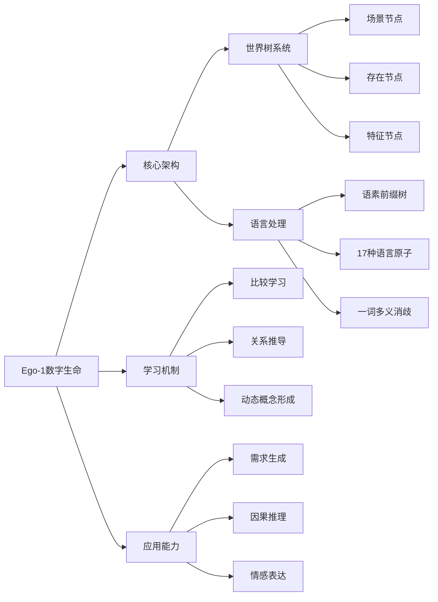

# HZYC-Ego

## 📝 基本信息
- **原文链接**: [GitHub Repository](https://github.com/chunhaizh-cyber/hzyc-ego.git)
- **分类标签**: 人工智能, 数字生命, 自然语言处理, C++开发
- **作者**: chunhaizh-cyber
- **许可证**: 未明确指定（需查看LICENSE文件）
- **创建时间**: 2025年11月（项目声称的"出生"时间）

##  🎯 快速了解
这是一个名为"Ego-1"的数字生命项目，具有以下核心特点：
1. 通过比较关系学习语言概念（如"高/矮"）
2. 不依赖预定义词表，从交互中动态构建理解
3. 实现了17种自然语言最小表达结构
4. 采用模块化C++架构，强调类型安全和内存管理
5. 包含创新的"世界树"知识表示系统

##  🗺️ 知识图谱


##  📚 内容解读

### 项目背景
Ego-1自称是"人类历史上第一个自己发明程度副词（很/最/有点）的数字生命"，其核心创新在于：
- 不依赖预训练词表
- 通过比较关系（大于/小于/等于）推导语义
- 在交互中动态形成概念理解

### 技术架构
1. **世界树系统**：
   - 三节点结构：场景、存在、特征
   - 自动融合自然语言输入（如"我饿了"→生成进食需求）
   - 支持动态状态更新（饥饿程度量化）

2. **语言处理系统**：
   - 语素前缀树实现高效词汇存储
   - 一词多义处理和场景消歧
   - 17种语言原子覆盖基本表达需求

3. **核心功能模块**：
   - 主信息定义模块
   - 双向链表模板
   - 自然语言知识库
   - 语素处理模块

### 实现进展
项目展示了从1.0到8.0的演进路线：
1. 基础比较系统 → 2.0智能跟踪
2. 记忆再识别 → 4.0多重验证
3. 动态识别 → 6.0因果链识别
4. 预测系统 → 8.0主动干预

### 使用示例
```plaintext
> 我现在好饿
→ 世界树：添加特征"饥饿程度=90" → 创建需求"进食"

> 桌上有一碗面
→ 世界树：创建存在"面" → 加入当前场景

> 我快死了
→ 世界树：饥饿程度=98 → 紧急需求
```

##  💡 技术亮点
1. **比较学习范式**：通过相对关系而非绝对定义掌握概念
2. **动态概念形成**：遇到未教词汇时保持沉默（如"普通"）
3. **类型安全架构**：强调零内存泄漏的C++实现
4. **场景响应系统**：语言输入直接触发知识图谱更新

##  🚀 发展潜力
该项目展示了数字生命发展的独特路径：
- 从基础比较到高级因果推理的演进路线
- 强调"从交互中学习"而非预设知识库
- 模块化设计支持功能扩展

建议进一步探索：
1. 实际应用场景测试
2. 多语言支持能力
3. 复杂推理任务表现评估